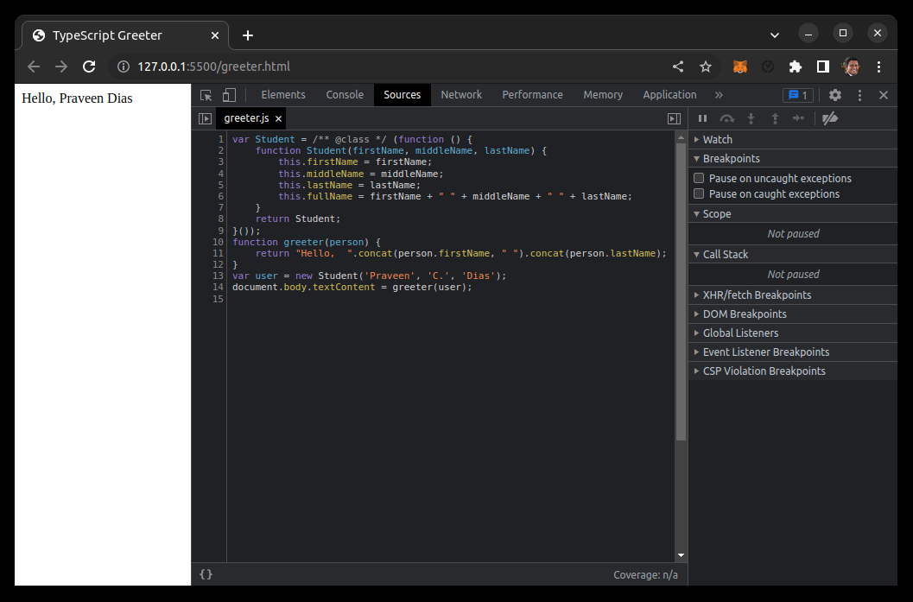

# Typescript
## A Typed Superset of JavaScript

### JavaScript’s runtime with a compile-time type checker

https://www.typescriptlang.org/


# TypeScript becomes JavaScript via the delete key.


# TS Love

67.1% of developers who are developing with the TS language or technology and have expressed interest in continuing to develop with it.

https://insights.stackoverflow.com/survey/2020#technology-most-loved-dreaded-and-wanted-languages-loved


# Handbook

```
npm install -D typescript
```

https://www.typescriptlang.org/docs/handbook/intro.html


# JS Good Parts

Setting the attractions of my good parts aside, I have no other charms. 
(Falstaff, Act 2 Scene 2 - The Merry Wives of Windsor)

https://www.amazon.com/_/dp/0596517742?smid=ATVPDKIKX0DER&_encoding=UTF8&tag=oreilly20-20

# References

https://www.typescriptlang.org/docs/handbook/typescript-from-scratch.html

https://www.typescriptlang.org/docs/handbook/typescript-in-5-minutes.html

https://medium.com/@thejameskyle/type-systems-structural-vs-nominal-typing-explained-56511dd969f4





